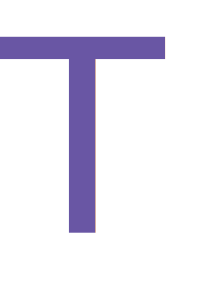

# create-typedef-app

 

> Tech stack template by Stephen Asuncion.

create-typedef-template is a full-stack web application template that contains the following technology stack:

- [Next.js](https://nextjs.org/)
- [TypeScript](https://typescriptlang.org/)
- [ChakraUI](https://chakra-ui.com/)
- [NextAuth.js](https://next-auth.js.org/)
- [Prisma](https://www.prisma.io/)
- [MongoDB](https://www.mongodb.com/)
- [Apollo GraphQL](https://www.apollographql.com/) (Type-safe)

## How to use

Go to [create-typedef-app repository](https://github.com/stephenasuncionDEV/create-typedef-app), and click `Use this template`.

### Configurations

GitHub Actions Secrets

```
DOCKER_HUB_USERNAME
DOCKER_HUB_REPOSITORY
DOCKER_HUB_ACCESS_TOKEN
```

Environment Variables (located in root)

- [.env](https://github.com/stephenasuncionDEV/create-typedef-app/blob/main/.env.example)
- [.env.local](https://github.com/stephenasuncionDEV/create-typedef-app/blob/main/.env.example)

## Updating Prisma

To extend any prisma models, run `npx prisma generate` to generate a new schema.

## Updating GraphQL Types

To updated grapql types, run `yarn graphql:compile` or `yarn graphql:watch`. Files will get generated to `@/graphql/types`.

> Note: Delete the `types` folder inside the `src/graphql` before generating a new one.

## Deploy with Vercel

[](https://vercel.com/new/clone?repository-url=https%3A%2F%2Fgithub.com%2FstephenasuncionDEV%2Fcreate-typedef-app&env=APP_NAME,SALT_KEY&envDescription=https%3A%2F%2Fgithub.com%2FstephenasuncionDEV%2Fcreate-typedef-app%2Fblob%2Fmain%2F.env.local.example&project-name=create-typedef-app&repo-name=create-typedef-app&demo-title=create-typedef-app&demo-description=A%20statically%20generated%20template%20for%20my%20go-to%20tech%20stack)

## License

[MIT](https://github.com/stephenasuncionDEV/create-typedef-app/blob/main/LICENSE)